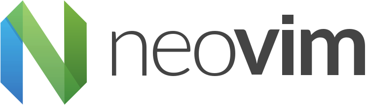

# NeoVim config


A personal Neovim configuration focused on productivity and modern development workflows.  
It uses **lazy.nvim** for plugin management, **Gruvbox** as colorscheme, and **LSP with nvim-cmp** for autocompletion and development support.


## Installation

Clone this repo into your Neovim config directory:

```bash
git clone https://github.com/liptun/nvim-config ~/.config/nvim
```


